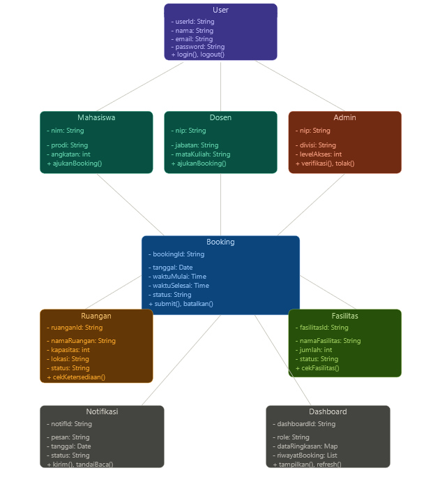

# Software Design Description
## For SCS (SmartRoom Campus System)

Version 0.1  
Prepared by Kelompok 5 
Siti Aisyah, Syifa Salma, Silvi Rusmiati, Salma Ikhti  
Rabu, 3 Juni 2026

## Table of Contents
<!-- TOC -->
* [1. Introduction](#1-introduction)
  * [1.1 Document Purpose](#11-document-purpose)
  * [1.2 Subject Scope](#12-subject-scope)
  * [1.3 Definitions, Acronyms, and Abbreviations](#13-definitions-acronyms-and-abbreviations)
  * [1.4 References](#14-references)
  * [1.5 Document Overview](#15-document-overview)
* [2. Design Overview](#2-design-overview)
  * [2.1 Stakeholder Concerns](#21-stakeholder-concerns)
  * [2.2 Selected Viewpoints](#22-selected-viewpoints)
* [3. Design Views](#3-design-views)
* [4. Decisions](#4-decisions)
* [5. Appendixes](#5-appendixes)
<!-- TOC -->

## Revision History
<!-- tracks document updates and reasons for change -->

| Name | Date | Reason For Changes | Version |
|------|------|--------------------|---------|
|      |      |                    |         |
|      |      |                    |         |

## A.	Penjelasan Sistem SRCS
Sistem yang dikembangkan dalam penelitian ini adalah Smart Room Campus System (SRCS) yang dibangun berbasis web application. Aplikasi berbasis web ini memungkinkan pengguna untuk mengakses sistem melalui browser tanpa perlu melakukan instalasi tambahan pada perangkat. Sistem dirancang agar dapat berjalan pada berbagai platform seperti komputer, laptop, maupun smartphone selama terhubung dengan jaringan internet. 

Secara arsitektur, sistem menggunakan konsep client-server, dimana: 
• Client merupakan perangkat pengguna (mahasiswa, dosen, admin) yang mengakses sistem melalui browser 
• Server berfungsi sebagai pusat pengolahan data dan penyimpanan database 

Sistem ini juga dirancang untuk: 
• Mendukung akses multi-user secara bersamaan 
• Menyediakan informasi secara real-time terkait ketersediaan ruangan 
• Terintegrasi dengan database untuk penyimpanan data peminjaman Dengan pendekatan berbasis web ini, diharapkan sistem dapat memberikan kemudahan akses, fleksibilitas pengguna.

### B.	Alasan Menggunakan Arsitektur Object Oriented (OO)

Objek dalam Sistem
Smart Room Campus System memiliki entitas-entitas nyata yang secara alami dapat direpresentasikan sebagai objek, antara lain:
•	User (Mahasiswa, Dosen, Admin Sapras): setiap pengguna memiliki data dan perilaku tersendiri
•	Ruangan: memiliki atribut seperti nama, kapasitas, dan fasilitas
•	Booking: merepresentasikan proses peminjaman ruangan
•	Notifikasi: objek yang dikirim ke pengguna berdasarkan status booking
•	Fasilitas: tambahan yang dapat diminta saat booking (proyektor, AC, dll)

Hubungan Antar Objek
Objek-objek dalam SRCS saling berinteraksi membentuk alur bisnis yang jelas:
•	User melakukan Booking terhadap Ruangan
•	Booking memiliki relasi ke Fasilitas yang diminta
•	Admin memverifikasi Booking dan mengubah statusnya
•	Notifikasi dikirim ke User berdasarkan perubahan status Booking

Hubungan ini wajar dalam OO karena Mahasiswa dan Dosen pada dasarnya sama-sama User, hanya berbeda hak akses , cukup dibuat satu class User yang diwarisi keduanya.
Keuntungan OO pada Sistem SRCS:

Modular:  setiap fitur berdiri sendiri, jadi kalau ada yang error atau perlu diubah, tidak mengganggu bagian lain.
Tidak perlu mengulang kode: Mahasiswa dan Dosen berbagi data dasar seperti nama dan password dari class User yang sama.
Mudah dikembangkan: kalau ke depannya mau tambah fitur baru seperti IoT atau integrasi sistem akademik, tinggal tambah class baru tanpa mengubah yang sudah ada.
Dekat dengan dunia nyata:  objek dalam sistem seperti Ruangan, Booking, dan Notifikasi mencerminkan hal-hal nyata di kampus, sehingga alur sistem lebih mudah dipahami semua pihak.

### C.	Identifikasi Object / Class

Berikut class-class yang terdapat dalam sistem SRCS beserta fungsinya:

1.	User: Class induk yang mewakili semua pengguna sistem. Menyimpan data dasar seperti nama, email, password, dan role. Class ini diwarisi oleh Mahasiswa, Dosen, dan Admin.
2.	Mahasiswa: Turunan dari User. Mewakili mahasiswa yang dapat mengajukan peminjaman ruangan untuk kegiatan akademik maupun organisasi.
3.	Dosen: Turunan dari User. Mewakili dosen yang dapat memesan ruangan untuk perkuliahan tambahan, seminar, atau bimbingan.
4.	Admin (Sapras): Turunan dari User. Bertanggung jawab memverifikasi permintaan booking, mengelola data ruangan, dan mengatur fasilitas.
5.	Ruangan: Mewakili ruang fisik di kampus. Menyimpan informasi seperti nama ruangan, kapasitas, lokasi, dan status ketersediaan.
6.	Booking: Mewakili proses peminjaman ruangan. Menyimpan data seperti siapa yang memesan, ruangan mana, tanggal dan waktu, serta status persetujuan.
7.	Fasilitas: Mewakili fasilitas tambahan yang bisa diminta saat booking, seperti proyektor, sound system, atau penataan kursi.
8.	Notifikasi: Mewakili pesan yang dikirim ke pengguna ketika status booking berubah (disetujui, ditolak, atau menunggu).
9.	Dashboard: Menampilkan ringkasan informasi utama sesuai role pengguna — booking aktif, riwayat, dan statistik penggunaan ruangan.

### Class Diagram
()

Class Diagram pada sistem SRCS menggambarkan struktur kelas-kelas yang ada di dalam sistem beserta atribut, method, dan hubungan antar kelasnya. Diagram ini menjadi fondasi utama dalam perancangan sistem berbasis Object Oriented karena menunjukkan bagaimana setiap objek saling terhubung dan berinteraksi satu sama lain.

Hubungan antar class dalam sistem SRCS adalah sebagai berikut:
•	Inheritance : Mahasiswa, Dosen, dan Admin mewarisi class User — artinya ketiga class tersebut mewarisi atribut dasar seperti nama, email, dan password dari class User, namun masing-masing memiliki atribut dan method tambahan sesuai perannya.
•	Asosiasi : Mahasiswa/Dosen membuat Booking, Admin memverifikasi Booking, dan Booking terhubung ke Ruangan menggambarkan hubungan antar objek yang saling berinteraksi dalam alur peminjaman ruangan.
•	Agregasi : Booking mengandung Fasilitas, artinya Fasilitas dapat berdiri sendiri tanpa harus ada Booking, namun Booking bisa memiliki satu atau lebih Fasilitas tambahan.

Selain itu, Booking menghasilkan Notifikasi yang dikirim ke pengguna, dan data Booking ditampilkan di Dashboard sesuai role masing-masing pengguna.

### 1.4 References
<!-- external sources cited (standards, specs, docs); include title, owner, version, date, and location -->

### 1.5 Document Overview
<!-- summary of document organization and conventions -->

## 2. Design Overview
<!-- describes the system’s architecture and design approach -->

### 2.1 Stakeholder Concerns
<!-- identifies stakeholders and their main design-related interests -->

### 2.2 Selected Viewpoints
<!-- lists viewpoints used to describe the system, their purpose, and addressed concerns -->

#### 2.2.1 Context
<!-- system boundaries, external actors, and interactions -->

#### 2.2.2 Composition
<!-- major components/subsystems and how they are organized -->

#### 2.2.3 Logical
<!-- main abstractions (classes, interfaces) and relationships -->

#### 2.2.4 Physical
<!-- hardware topology and infrastructure constraints -->

#### 2.2.5 Structure
<!-- internal organization of components and connectors -->

#### 2.2.6 Dependency
<!-- relationships and dependencies among design elements -->

#### 2.2.7 Information
<!-- data structures, persistence, and data management -->

#### 2.2.8 Interface
<!-- contracts between components or with external systems -->

#### 2.2.9 Interaction
<!-- runtime message flow and collaboration among components -->

#### 2.2.10 Algorithm
<!-- processing logic, steps, and key computations -->

#### 2.2.11 State Dynamics
<!-- states, transitions, and events affecting system behavior -->

#### 2.2.12 Concurrency
<!-- handling of parallelism, synchronization, and ordering -->

#### 2.2.13 Patterns
<!-- design or architectural patterns applied and their roles -->

#### 2.2.14 Deployment
<!-- mapping of software components to physical nodes or environments -->

#### 2.2.15 Resources
<!-- resource use, allocation, and management (e.g., memory, threads) -->

## 3. Design Views
<!-- detailed architectural and design elements, diagrams, and rationale -->

## 4. Decisions
<!-- major design or architectural choices and their justifications -->

## 5. Appendixes
<!-- supporting material such as models, datasets, or references -->
