# Software Design Description
## For SCS (SmartRoom Campus System)

Version 0.1  
Prepared by Kelompok 5 
Siti Aisyah, Syifa Salma, Silvi Rusmiati, Salma Ikhti  
Rabu, 3 Juni 2026

## Table of Contents
<!-- TOC -->
* [1. Introduction](#1-introduction)
  * [1.1 Document Purpose](#11-document-purpose)
  * [1.2 Subject Scope](#12-subject-scope)
  * [1.3 Definitions, Acronyms, and Abbreviations](#13-definitions-acronyms-and-abbreviations)
  * [1.4 References](#14-references)
  * [1.5 Document Overview](#15-document-overview)
* [2. Design Overview](#2-design-overview)
  * [2.1 Penjelasan Sistem SRCS](#21-stakeholder-concerns)
  * [2.2 Alasan Menggunakan Arsitektur Object Oriented (OO)](#22-alasan-menggunakan-arsitektur-object-oriented-(OO))
  * [2.3 Desain Data](#23-Desain-Data)
  * [2.4 Struktur File/Tabel (Kamus Data)](#24-Struktur-File/Tabel-(KamusData))
* [3. Design Views](#3-design-views)
   * [3.1 Identifikasi Objek Atau Class](#31-identifikasi-object)
   * [3.2 Class Diagram](#32-class-diagram)
   * [3.3 Activity Diagram Login ](#33-activity-diagram-login)
   * [3.4 Activity Diagram Booking Ruangan ](#34-activity-diagram-booking-ruangan)
   * [3.5 Swimlane Diagram](#35-swimlane-diagram)
   * [3.6 Fokus Perancangan Antar Muka](#36-fokus-perancangan-antar-muka)
<!-- TOC -->

## Revision History
<!-- tracks document updates and reasons for change -->

| Name | Date | Reason For Changes | Version |
|------|------|--------------------|---------|
|      |      |                    |         |
|      |      |                    |         |

# 1. Introduction

## 1.1 Document Purpose
Dokumen Software Design Description (SDD) ini dibuat untuk mendeskripsikan rancangan perangkat lunak Smart Room Campus System (SRCS) secara terstruktur dan terperinci. Dokumen ini berfungsi sebagai acuan bagi tim pengembang dalam proses implementasi sistem, serta memberikan gambaran mengenai arsitektur, desain antarmuka, struktur kelas, dan mekanisme kerja sistem kepada seluruh stakeholder yang terlibat.

Selain itu, dokumen ini menjadi dasar dalam memastikan bahwa desain yang dikembangkan telah sesuai dengan kebutuhan yang telah didefinisikan pada dokumen Software Requirements Specification (SRS).

## 1.2 Subject Scope
Smart Room Campus System (SRCS) merupakan aplikasi berbasis web yang dirancang untuk membantu pengelolaan dan peminjaman ruangan di lingkungan kampus secara digital. Sistem ini memungkinkan mahasiswa, dosen, dan admin untuk mengakses informasi ketersediaan ruangan secara real-time, melakukan pemesanan ruangan secara online, serta mengelola proses persetujuan peminjaman secara terintegrasi.

Fitur utama yang tersedia dalam sistem meliputi login dan autentikasi pengguna, pengecekan ketersediaan ruangan, pemesanan ruangan, verifikasi peminjaman oleh admin, pengelolaan fasilitas ruangan, serta notifikasi status peminjaman.

## 1.3 Definitions, Acronyms, and Abbreviations
| Istilah/Singkatan | Keterangan                                                                                           |
| ----------------- | ---------------------------------------------------------------------------------------------------- |
| SRCS              | Smart Room Campus System                                                                             |
| SDD               | Software Design Description                                                                          |
| SRS               | Software Requirements Specification                                                                  |
| GUI               | Graphical User Interface                                                                             |
| Admin Sapras      | Pengelola sarana dan prasarana kampus yang bertanggung jawab melakukan verifikasi peminjaman ruangan |
| Booking           | Proses pemesanan atau peminjaman ruangan                                                             |
| Real-Time         | Informasi yang ditampilkan secara langsung sesuai kondisi terkini                                    |
| Database          | Tempat penyimpanan data yang digunakan oleh sistem                                                   |
| Client-Server     | Arsitektur sistem yang memisahkan pengguna (client) dan pengelola data (server)                      |

## 1.4 References
Dokumen ini disusun berdasarkan referensi berikut:
1. Dokumen Software Requirements Specification (SRS) Smart Room Campus System (SRCS).
2. Materi Rekayasa Perangkat Lunak (RPL).
3. Hasil wawancara dengan bagian Sarana dan Prasarana (Sapras) kampus.
4. Kebutuhan pengguna yang diperoleh dari mahasiswa dan dosen sebagai calon pengguna sistem.

## 1.5 Document Overview
Dokumen DDP ini terdiri dari beberapa bagian penting. Bab Pendahuluan menguraikan tujuan, ruang lingkup, definisi istilah, referensi, dan gambaran umum dokumen. Bab Gambaran Desain memberikan penjelasan umum mengenai desain sistem serta pendekatan yang diambil dalam pengembangan software. Bab Pandangan Desain berisi rincian desain sistem, termasuk diagram kelas, diagram aktivitas, diagram swimlane, dan desain antarmuka pengguna. Bab Keputusan menjelaskan keputusan desain yang diambil selama proses pembuatan, sementara bagian Lampiran memuat materi dukung yang relevan dengan dokumentasi desain sistem.

# 2. Design Overview

## 2.1 Penjelasan Sistem SRCS
Sistem yang dikembangkan dalam penelitian ini adalah Smart Room Campus System (SRCS) yang dibangun berbasis web application. Aplikasi berbasis web ini memungkinkan pengguna untuk mengakses sistem melalui browser tanpa perlu melakukan instalasi tambahan pada perangkat. Sistem dirancang agar dapat berjalan pada berbagai platform seperti komputer, laptop, maupun smartphone selama terhubung dengan jaringan internet. 

Secara arsitektur, sistem menggunakan konsep client-server, dimana: 
• Client merupakan perangkat pengguna (mahasiswa, dosen, admin) yang mengakses sistem melalui browser 
• Server berfungsi sebagai pusat pengolahan data dan penyimpanan database 

Sistem ini juga dirancang untuk: 
• Mendukung akses multi-user secara bersamaan 
• Menyediakan informasi secara real-time terkait ketersediaan ruangan 
• Terintegrasi dengan database untuk penyimpanan data peminjaman Dengan pendekatan berbasis web ini, diharapkan sistem dapat memberikan kemudahan akses, fleksibilitas pengguna.

### 2.2 Alasan Menggunakan Arsitektur Object Oriented (OO)

Objek dalam Sistem
Smart Room Campus System memiliki entitas-entitas nyata yang secara alami dapat direpresentasikan sebagai objek, antara lain:
•	User (Mahasiswa, Dosen, Admin Sapras): setiap pengguna memiliki data dan perilaku tersendiri
•	Ruangan: memiliki atribut seperti nama, kapasitas, dan fasilitas
•	Booking: merepresentasikan proses peminjaman ruangan
•	Notifikasi: objek yang dikirim ke pengguna berdasarkan status booking
•	Fasilitas: tambahan yang dapat diminta saat booking (proyektor, AC, dll)

Hubungan Antar Objek
Objek-objek dalam SRCS saling berinteraksi membentuk alur bisnis yang jelas:
•	User melakukan Booking terhadap Ruangan
•	Booking memiliki relasi ke Fasilitas yang diminta
•	Admin memverifikasi Booking dan mengubah statusnya
•	Notifikasi dikirim ke User berdasarkan perubahan status Booking

Hubungan ini wajar dalam OO karena Mahasiswa dan Dosen pada dasarnya sama-sama User, hanya berbeda hak akses , cukup dibuat satu class User yang diwarisi keduanya.
Keuntungan OO pada Sistem SRCS:

Modular:  setiap fitur berdiri sendiri, jadi kalau ada yang error atau perlu diubah, tidak mengganggu bagian lain.
Tidak perlu mengulang kode: Mahasiswa dan Dosen berbagi data dasar seperti nama dan password dari class User yang sama.
Mudah dikembangkan: kalau ke depannya mau tambah fitur baru seperti IoT atau integrasi sistem akademik, tinggal tambah class baru tanpa mengubah yang sudah ada.
Dekat dengan dunia nyata:  objek dalam sistem seperti Ruangan, Booking, dan Notifikasi mencerminkan hal-hal nyata di kampus, sehingga alur sistem lebih mudah dipahami semua pihak.

### 2.3 Desain Data
1.	Mengidentifikasi dan menetapkan seluruh himpunan entity yang akan terlibat.
a.	Pengguna (Mencakup Mahasiswa, Dosen, Admin Sapras, dan Perwakilan Organisasi) 
b.	Ruangan 
c.	Pemesanan (Booking) 
d.	Fasilitas (Fasilitas tambahan di luar fasilitas bawaan ruangan)

2.	Menentukan atribut-atribut key dari masing-masing himpunan entitas.
Setiap entitas membutuhkan atribut penjelas dan satu atribut unik sebagai penanda (Primary Key). 
a.	Pengguna → id_user (PK), nim_nidn, nama_lengkap, role (mahasiswa/dosen/admin/organisasi), no_wa, password 
b.	Ruangan →  id_ruangan (PK), nama_ruangan, kapasitas, status_aktif 
c.	Pemesanan → id_booking (PK), tanggal_kegiatan, waktu_mulai, waktu_selesai, keperluan, file_surat, status_persetujuan 
d.	Fasilitas → id_fasilitas (PK), nama_fasilitas, jumlah_tersedia 

3.	Mengidentifikasi dan menetapkan seluruh himpunan relasi diantara himpunan entitas yang ada beserta Foreign-keynya.
a.	Melakukan: Relasi antara Pengguna dan Pemesanan. 
	FK: id_user menunjuk ke entitas Pengguna. FK ini diletakkan di dalam entitas Pemesanan.
b.	Dipesan: Relasi antara Ruangan dan Pemesanan.
	FK: id_ruangan menunjuk ke entitas Ruangan. FK ini diletakkan di dalam entitas Pemesanan.
c.	Membutuhkan: Relasi antara Pemesanan dan Fasilitas.
	Karena satu pemesanan bisa memakai banyak fasilitas, dan satu fasilitas bisa dipakai di banyak pemesanan, relasi ini memunculkan tabel perantara/detail baru, yaitu Detail_Fasilitas.
	FK: id_booking menunjuk ke Pemesanan dan id_fasilitas menunjuk ke Fasilitas. Kedua FK ini diletakkan di dalam tabel Detail_Fasilitas.

4.	Menentukan derajat dan kardinality rasio relasi untuk setiap himpunan relasi.
Menetapkan batasan jumlah interaksi antar-entitas.
a.	Pengguna (1) : Pemesanan (M) → Satu pengguna dapat melakukan banyak pemesanan. 
b.	Ruangan (1) : Pemesanan (M) → Satu ruangan dapat dipesan berkali-kali pada waktu yang berbeda. 
c.	Pemesanan (M) : Fasilitas (M) → Banyak pemesanan dapat memakai banyak fasilitas tambahan. 

5.	Menentukan Partisipan constraint dari suatu relasi untuk setiap himpunan relasi.
a.	Pengguna - Pemesanan = Partial. (Tidak semua pengguna yang terdaftar di sistem pasti pernah meminjam ruangan). 
b.	Ruangan - Pemesanan = Partial. (Bisa jadi ada ruangan baru yang belum pernah dipesan sama sekali). 
c.	Pemesanan - Pengguna & Ruangan = Total. (Setiap data pemesanan yang masuk pasti terikat secara wajib dengan 1 pengguna yang meminjam dan 1 ruangan yang dipinjam).

6.	Melengkapi himpunan relasi dengan atribut-atribut yang bukan kunci (non-key)
Pemesanan → tanggal_kegiatan, waktu_mulai, waktu_selesai, keperluan, file_surat, status_persetujuan.

7.  Mapping File (Relasi ke Tabel)

**Mapping Tabel**

| Entitas/Relasi        | Mapping Tabel                                                                         |
| :---                  | :---                                                                                  |
| Pengguna              | Pengguna(id_user PK, nim_nidn, nama_lengkap, role, no_wa, password)                   |
| Ruangan               | Ruangan(id_ruangan PK, nama_ruangan, kapasitas, status_aktif)                         |
| Pemesanan             | Pemesanan(id_booking PK, id_user FK, id_ruangan FK, tanggal_kegiatan, waktu_mulai, waktu_selesai, keperluan, file_surat, status_persetujuan)                                                       |
| Fasilitas             | Fasilitas(id_fasilitas PK, nama_fasilitas, jumlah_tersedia)                           |
| Detail_Fasilitas      | Detail_Fasilitas(id_booking FK, id_fasilitas FK)                                      |

**Diagram**
(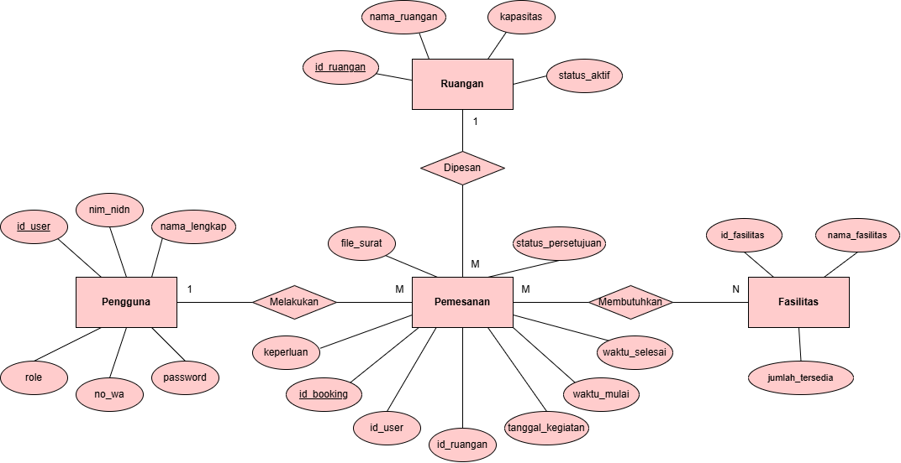)

### 2.4 Struktur File/Tabel (Kamus Data)

a. Tabel Pengguna

| Field          | Tipe Data | Keterangan                           |
| :---           | :---      | :---                                 |
| id_user        | VARCHAR   | Primary Key                          | 
| nim_nidn       | VARCHAR   | Nomor Induk Mahasiswa/Dosen          |
| nama_lengkap   | VARCHAR   | Nama lengkap pengguna                |
| role           | ENUM      | Mahasiswa, Dosen, Admin, Organisasi  |
| no_wa          | VARCHAR   | Nomor WhatsApp                       |
| password       | VARCHAR   | Kata sandi login                     |

b. Tabel Ruangan

| Field         | Tipe Data   | Keterangan                          |
| :---          | :---        | :---                                |
| id_ruangan    | VARCHAR     | Primary Key                         |
| nama_ruangan  | VARCHAR     | Nama ruangan                        |
| kapasitas     | INT         | Daya tampung maksimal ruangan       |
| status_aktif  | ENUM        | Aktif, Tidak Aktif                  |

c. Tabel Pemesanan

| Field               | Tipe Data | Keterangan                          |
| :---                | :---      | :---                                |
| id_booking          | VARCHAR   | Primary Key                         |
| id_user             | VARCHAR   | Foreign Key → Pengguna              |
| id_ruangan          | VARCHAR   | Foreign Key → Ruangan               |
| tanggal_kegiatan    | DATE      | Tanggal penggunaan ruangan          |
| waktu_mulai         | TIME      | Jam mulai kegiatan                  |
| waktu_selesai       | TIME      | Jam selesai kegiatan                |
| keperluan           | TEXT      | Deskripsi atau nama kegiatan        |
| file_surat          | VARCHAR   | Direktori file dokumen persyaratan  |
| status_persetujuan  | ENUM      | Menunggu, Disetujui, Ditolak        |

d. Tabel Fasilitas

| Field           | Tipe Data | Keterangan               |
| :---            | :---      | :---                     |
| id_fasilitas    | VARCHAR   | Primary Key              |
| nama_fasilitas  | VARCHAR   | Nama fasilitas           |
| jumlah_tersedia | INT       | Stok fasilitas yang ada  |

e. Tabel Detail Fasilitas

| Field         | Tipe Data | Keterangan              |
| :---          | :---      | :---                    |
| id_booking    | VARCHAR   | Foreign Key → Pemesanan |
| id_fasilitas  | VARCHAR   | Foreign Key → Fasilitas |

9. Database
Berikut adalah tangkapan layar implementasi skema database pada phpMyAdmin:

Gambar 1: Struktur Database Keseluruhan (SCS)
  (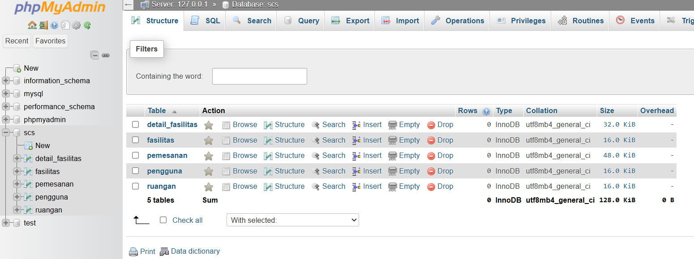)

Gambar 2: Struktur Tabel Pengguna
  (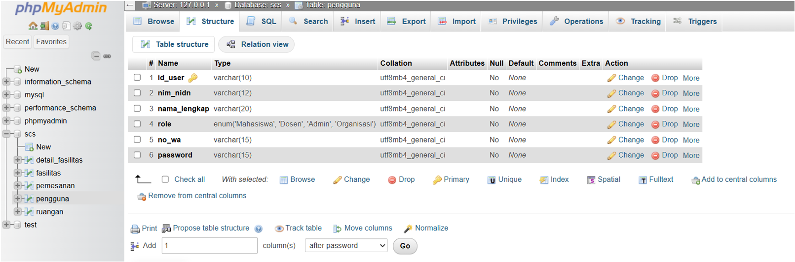)

Gambar 3: Struktur Tabel Ruangan
  (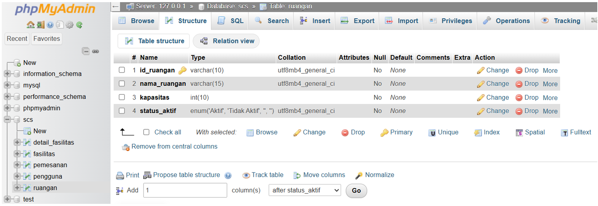)

Gambar 4: Struktur Tabel Pemesanan
  (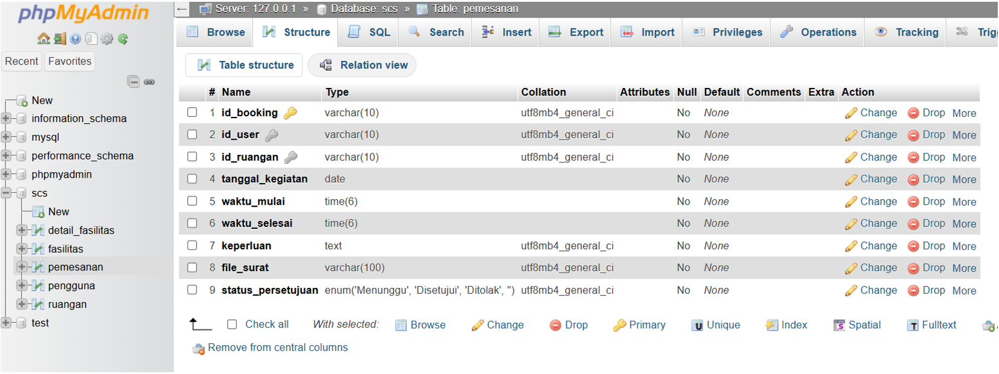)

Gambar 5: Struktur Tabel Fasilitas
  (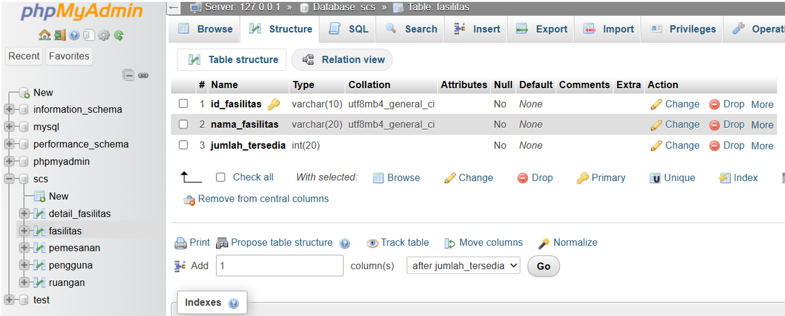)

Gambar 6: Struktur Tabel Detail Fasilitas
  (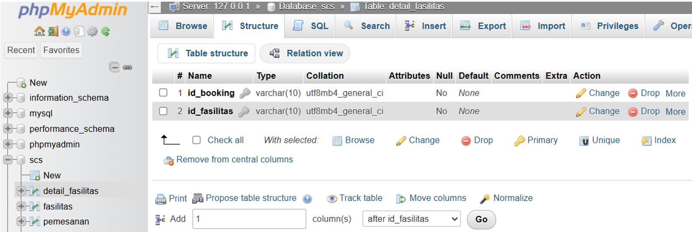)

Gambar 6: Relasi Antar Entitas
  (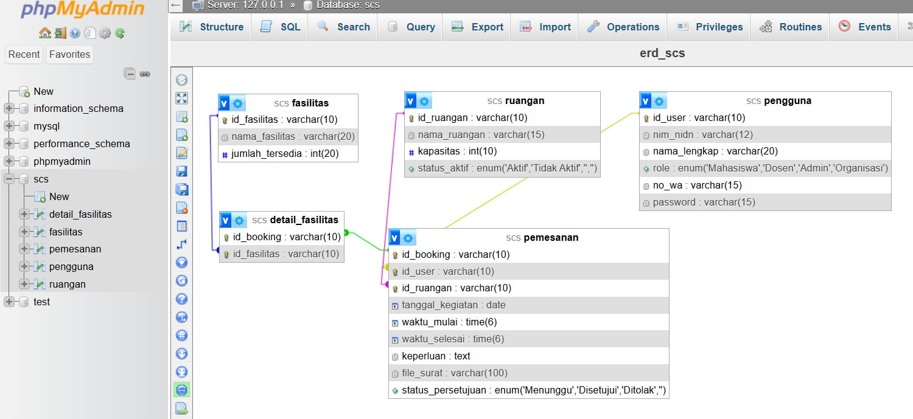)

  (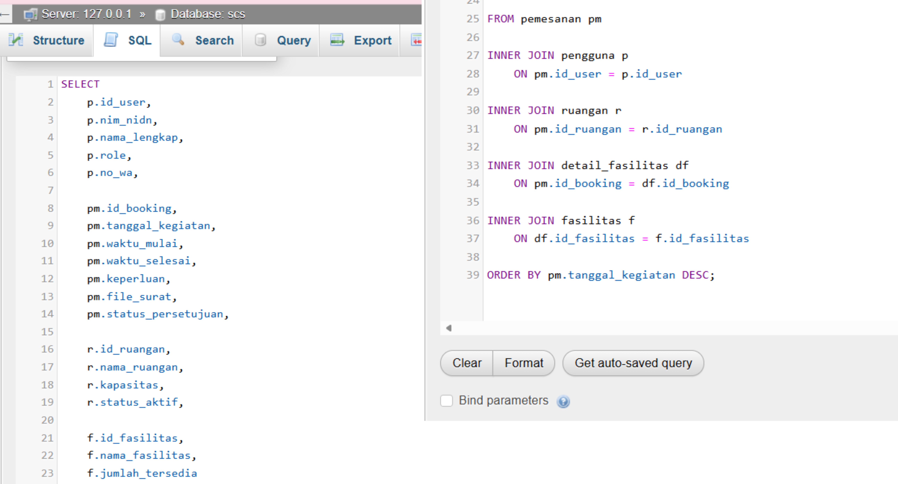)

# 3. Design View

### 3.1	Identifikasi Object / Class

Berikut class-class yang terdapat dalam sistem SRCS beserta fungsinya:

1.	User: Class induk yang mewakili semua pengguna sistem. Menyimpan data dasar seperti nama, email, password, dan role. Class ini diwarisi oleh Mahasiswa, Dosen, dan Admin.
2.	Mahasiswa: Turunan dari User. Mewakili mahasiswa yang dapat mengajukan peminjaman ruangan untuk kegiatan akademik maupun organisasi.
3.	Dosen: Turunan dari User. Mewakili dosen yang dapat memesan ruangan untuk perkuliahan tambahan, seminar, atau bimbingan.
4.	Admin (Sapras): Turunan dari User. Bertanggung jawab memverifikasi permintaan booking, mengelola data ruangan, dan mengatur fasilitas.
5.	Ruangan: Mewakili ruang fisik di kampus. Menyimpan informasi seperti nama ruangan, kapasitas, lokasi, dan status ketersediaan.
6.	Booking: Mewakili proses peminjaman ruangan. Menyimpan data seperti siapa yang memesan, ruangan mana, tanggal dan waktu, serta status persetujuan.
7.	Fasilitas: Mewakili fasilitas tambahan yang bisa diminta saat booking, seperti proyektor, sound system, atau penataan kursi.
8.	Notifikasi: Mewakili pesan yang dikirim ke pengguna ketika status booking berubah (disetujui, ditolak, atau menunggu).
9.	Dashboard: Menampilkan ringkasan informasi utama sesuai role pengguna — booking aktif, riwayat, dan statistik penggunaan ruangan.

### 3.2  Class Diagram
()

Class Diagram pada sistem SRCS menggambarkan struktur kelas-kelas yang ada di dalam sistem beserta atribut, method, dan hubungan antar kelasnya. Diagram ini menjadi fondasi utama dalam perancangan sistem berbasis Object Oriented karena menunjukkan bagaimana setiap objek saling terhubung dan berinteraksi satu sama lain.

Hubungan antar class dalam sistem SRCS adalah sebagai berikut:
•	Inheritance : Mahasiswa, Dosen, dan Admin mewarisi class User — artinya ketiga class tersebut mewarisi atribut dasar seperti nama, email, dan password dari class User, namun masing-masing memiliki atribut dan method tambahan sesuai perannya.
•	Asosiasi : Mahasiswa/Dosen membuat Booking, Admin memverifikasi Booking, dan Booking terhubung ke Ruangan menggambarkan hubungan antar objek yang saling berinteraksi dalam alur peminjaman ruangan.
•	Agregasi : Booking mengandung Fasilitas, artinya Fasilitas dapat berdiri sendiri tanpa harus ada Booking, namun Booking bisa memiliki satu atau lebih Fasilitas tambahan.

Selain itu, Booking menghasilkan Notifikasi yang dikirim ke pengguna, dan data Booking ditampilkan di Dashboard sesuai role masing-masing pengguna.

### 3.3 Activity Diagram Login
Activity Diagram Login menggambarkan alur aktivitas yang terjadi ketika pengguna (Mahasiswa, Dosen, atau Admin) masuk ke dalam sistem SRCS. Diagram ini menunjukkan bagaimana sistem merespons setiap aksi pengguna, termasuk kondisi normal maupun kondisi alternatif seperti data salah atau kosong

(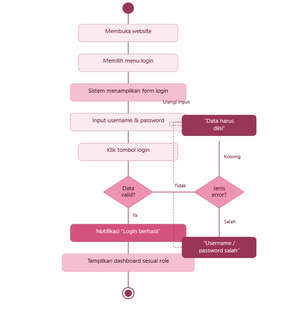)

•	Pink muda		: aksi yang dilakukan pengguna 
•	Pink sedang		: respons dari sistem 
•	Pink tua		: notifikasi berhasil 
•	Pink gelap		: pesan error / peringatan 
•	Pink pastel : diamond	: titik keputusan / decision

Activity Diagram Login ini menggambarkan dua jalur utama:

•	Jalur normal
Pengguna membuka website, memilih menu login, mengisi username dan password, lalu menekan tombol login. Jika data valid, sistem menampilkan notifikasi berhasil dan langsung mengarahkan ke dashboard sesuai role masing-masing (mahasiswa, dosen, atau admin).
•	Jalur alternatif
Jika data tidak valid, sistem membedakan dua jenis kesalahan. Pertama, jika kolom kosong, muncul pesan "Data harus diisi". Kedua, jika username atau password salah, muncul pesan "Username/password salah". Keduanya mengarahkan pengguna kembali ke form untuk mencoba lagi.
  

### 3.4	Activity Diagram Booking Ruangan

(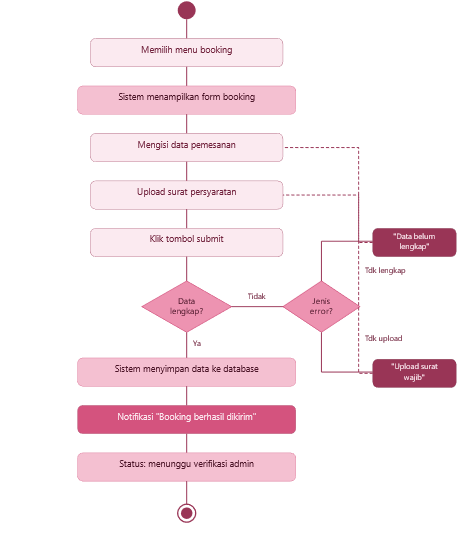)

Activity Diagram Booking Ruangan menggambarkan proses pengajuan peminjaman ruangan oleh Mahasiswa atau Dosen setelah berhasil login.

•	Jalur normal
Pengguna memilih menu booking, sistem menampilkan form, pengguna mengisi data pemesanan seperti tanggal, waktu, dan keperluan kegiatan, lalu mengupload surat persyaratan dalam format PDF. Setelah klik submit dan semua data lengkap, sistem menyimpan data ke database dan mengirim notifikasi "Booking berhasil dikirim". Status booking kemudian berubah menjadi menunggu verifikasi admin.
•	Jalur alternatif 
Sistem mengecek dua kemungkinan error. Pertama, jika data pemesanan belum lengkap, muncul pesan "Data belum lengkap" dan pengguna diarahkan kembali ke form isian. Kedua, jika surat persyaratan belum diupload, muncul pesan "Upload surat wajib" dan pengguna diarahkan kembali ke bagian upload.

## 3.5  Swimlane Diagram
Login & Booking Ruangan

(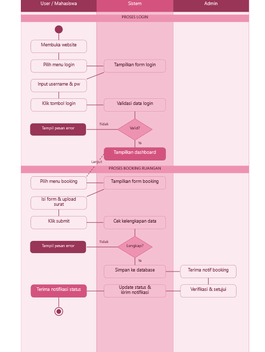)

Swimlane Diagram ini membagi alur sistem ke dalam tiga jalur (lane)
Berdasarkan aktor yang terlibat, yaitu User/Mahasiswa, Sistem, dan Admin. Tujuannya adalah untuk menunjukkan dengan jelas siapa yang bertanggung jawab atas setiap aktivitas dalam proses login dan booking ruangan.

•	Proses Login: dimulai dari User yang membuka website dan memilih menu login. Sistem merespons dengan menampilkan form, lalu User mengisi dan mengirim data. Sistem kemudian memvalidasi,  jika valid, dashboard ditampilkan; jika tidak, pesan error muncul dan User diminta mengulang.
•	Proses Booking: setelah login, User memilih menu booking. Sistem menampilkan form, User mengisi data dan mengupload surat persyaratan, lalu klik submit. Sistem mengecek kelengkapan data, jika lengkap, data disimpan ke database dan notifikasi dikirim ke Admin. Admin menerima notifikasi, melakukan verifikasi, lalu menyetujui atau menolak. Sistem memperbarui status booking dan mengirimkan notifikasi hasil ke User.

### 3.6	Fokus Perancangan Antarmuka
a.	Desain Antarmuka Inter-Modular
Menggambarkan hubungan dan aliran data antar modul yang ada di dalam sistem SRCS. Setiap modul saling terhubung dan dikendalikan oleh aliran data yang mengalir dari satu modul ke modul lainnya 

Diagram ini menunjukkan bagaimana setiap modul dalam SRCS saling terhubung dan berbagi data satu sama lain.

Login menjadi pintu masuk utama: setelah autentikasi berhasil, pengguna diarahkan ke Dashboard yang berfungsi sebagai pusat navigasi sistem.

Dari Dashboard, pengguna dapat mengakses empat modul utama. Cek Ruangan memungkinkan pengguna melihat ketersediaan ruangan secara real-time, dan hasilnya dapat langsung diteruskan ke modul Booking untuk memilih slot waktu. Modul Notifikasi menerima data dari Booking dan mengirimkan status peminjaman ke pengguna. Modul Approval Admin menerima data booking, lalu admin memverifikasi dan hasilnya dikirim kembali ke Dashboard untuk memperbarui data secara keseluruhan.

(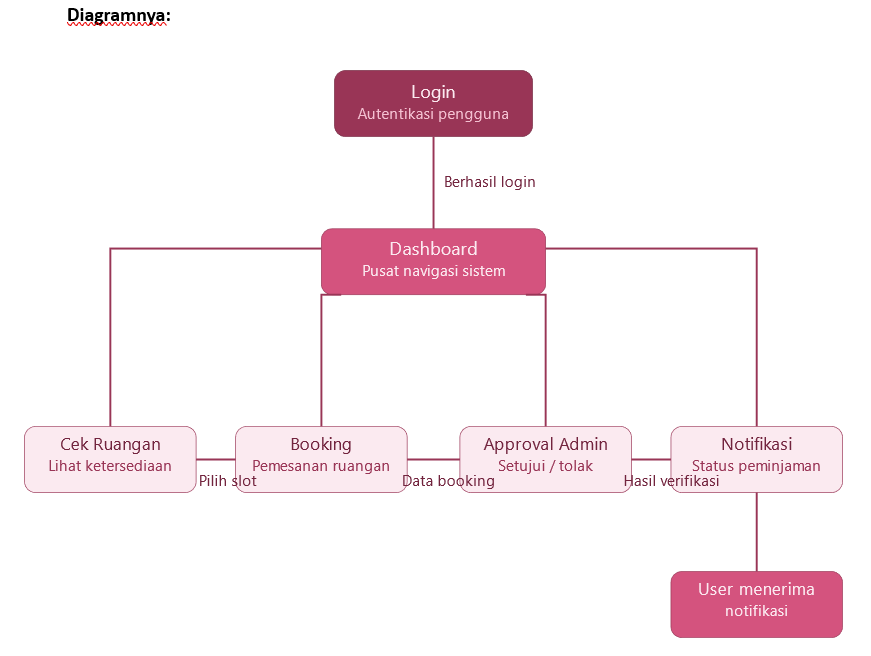)

b.	Desain Antarmuka Eksternal
Desain Antarmuka Eksternal menggambarkan hubungan sistem SRCS dengan pihak atau perangkat di luar sistem itu sendiri, yaitu pengguna (Mahasiswa, Dosen, Admin), browser sebagai media akses, serta database dan server sebagai penyimpanan data. Sesuai materi, antarmuka eksternal mencakup antarmuka antar aplikasi dan antarmuka antara perangkat lunak dengan produsen/konsumen informasi non-manusia.

(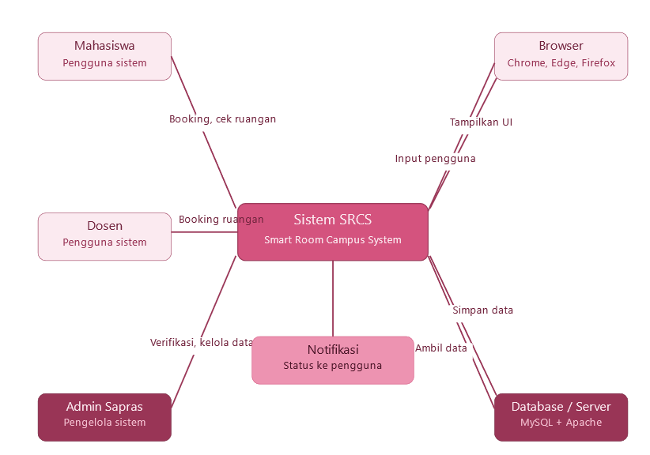)

Diagram ini menunjukkan bagaimana sistem SRCS berinteraksi dengan pihak dan perangkat di luar sistem.

Dari sisi pengguna, Mahasiswa dan Dosen berinteraksi dengan sistem untuk melakukan booking dan mengecek ketersediaan ruangan. Admin Sapras berinteraksi untuk memverifikasi dan mengelola data ruangan. Ketiga pengguna ini mengakses sistem melalui Browser (Chrome, Edge, atau Firefox), browser mengirimkan input pengguna ke sistem dan sistem mengembalikan tampilan antarmuka.

Dari sisi teknis, sistem terhubung dua arah dengan Database/Server, sistem menyimpan data booking ke database dan mengambil data kembali saat dibutuhkan. Setelah proses selesai, sistem mengirimkan Notifikasi status peminjaman kembali ke pengguna.

c.	Desain Antarmuka Manusia-Komputer

1.	Halaman Dashboard
Dashboard adalah halaman pertama yang muncul setelah pengguna berhasil login. Tampilannya disesuaikan dengan role pengguna, pada contoh ini adalah mahasiswa. Halaman ini menampilkan ringkasan booking aktif, jumlah booking yang sedang menunggu persetujuan, dan total booking bulan ini. Di bawahnya terdapat daftar peminjaman aktif beserta statusnya (Disetujui / Menunggu) dan riwayat booking terbaru. Tombol + Booking Ruangan ditempatkan di pojok kanan atas agar mudah diakses kapan saja.
 
(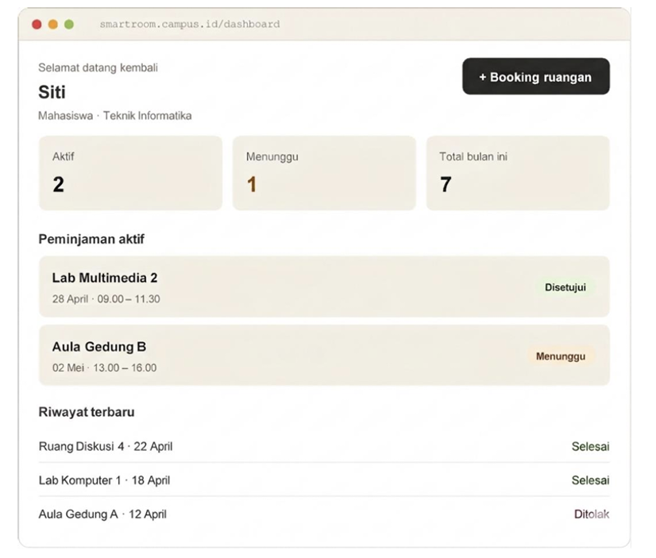)

2.	Halaman Cek Ketersediaan Ruangan
Halaman ini menampilkan kalender mingguan yang menunjukkan ketersediaan ruangan secara real-time. Pengguna dapat memilih ruangan melalui dropdown di pojok kanan atas dan berpindah minggu menggunakan tombol navigasi kiri-kanan. Setiap slot waktu diberi kode warna yang jelas, hijau untuk tersedia, merah untuk sudah terbooking, dan kuning untuk menunggu persetujuan admin. Dengan tampilan ini pengguna langsung bisa melihat slot mana yang bisa dipesan tanpa perlu bertanya ke admin.

(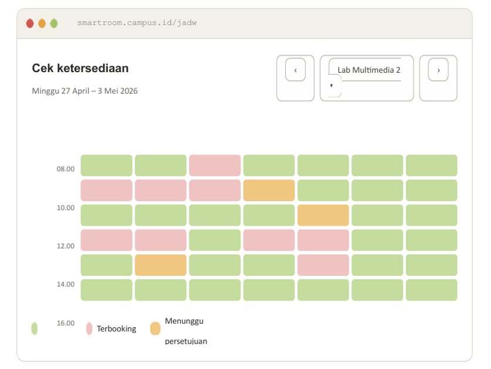)

3.	Halaman Admin	
Halaman ini khusus untuk Admin Sapras. Menampilkan daftar semua permintaan booking yang masuk dalam bentuk tabel, dilengkapi filter berdasarkan tanggal dan ruangan. Setiap baris menampilkan nama pemohon, ruangan yang diminta, tanggal dan jam, serta status saat ini. Admin dapat langsung mengklik tombol Setujui atau Tolak pada setiap permintaan yang masih berstatus Menunggu, sedangkan yang sudah disetujui hanya menampilkan tombol Detail.

(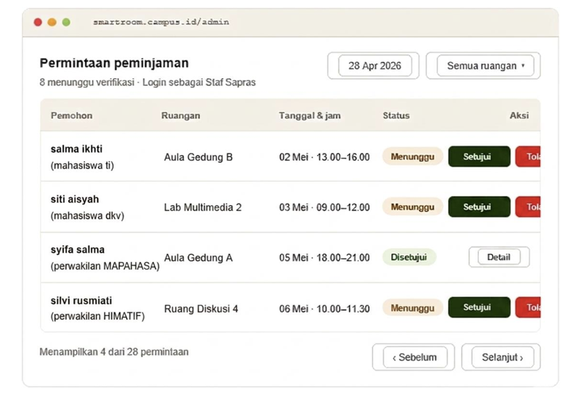)

4. Form Pemesanan Ruangan
Form ini muncul ketika pengguna menekan tombol booking. Pengguna mengisi ruangan yang diinginkan melalui dropdown, menentukan tanggal, waktu mulai dan selesai, serta keperluan kegiatan. Terdapat area upload surat permohonan dalam format PDF maksimal 2 MB. Di bagian bawah tersedia checklist fasilitas tambahan yang bisa diminta seperti proyektor, sound system, mic wireless, AC tambahan, dan penataan kursi. Setelah semua terisi, pengguna menekan tombol Kirim Permintaan.

(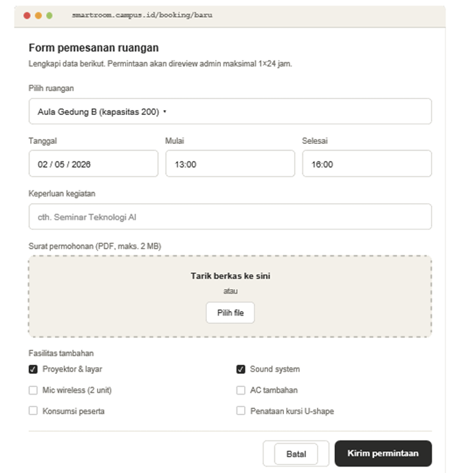)
